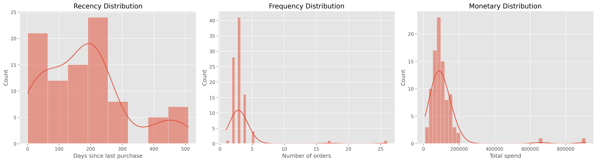
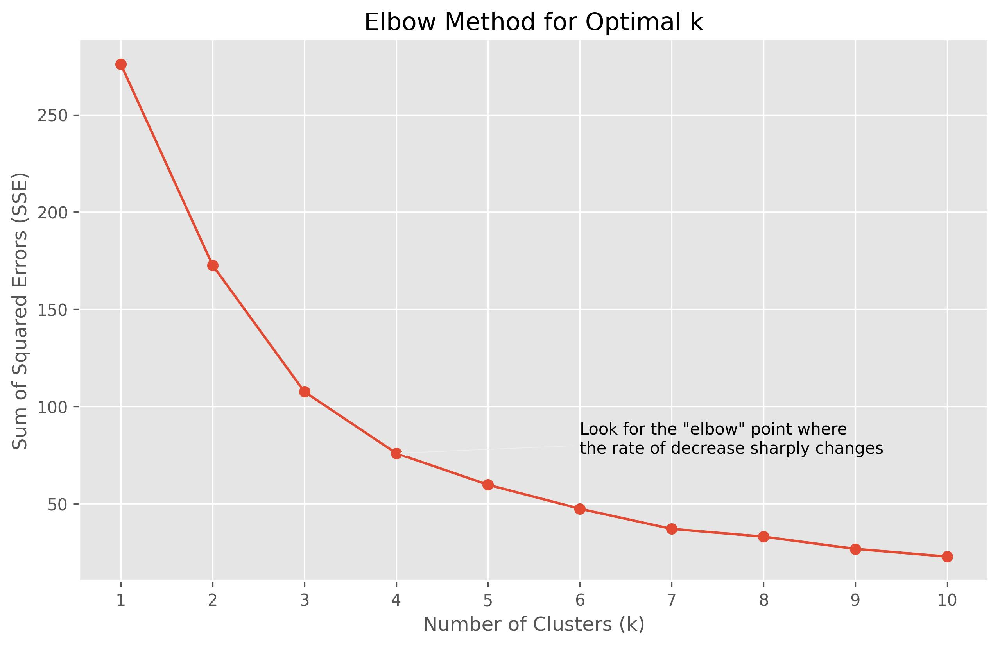
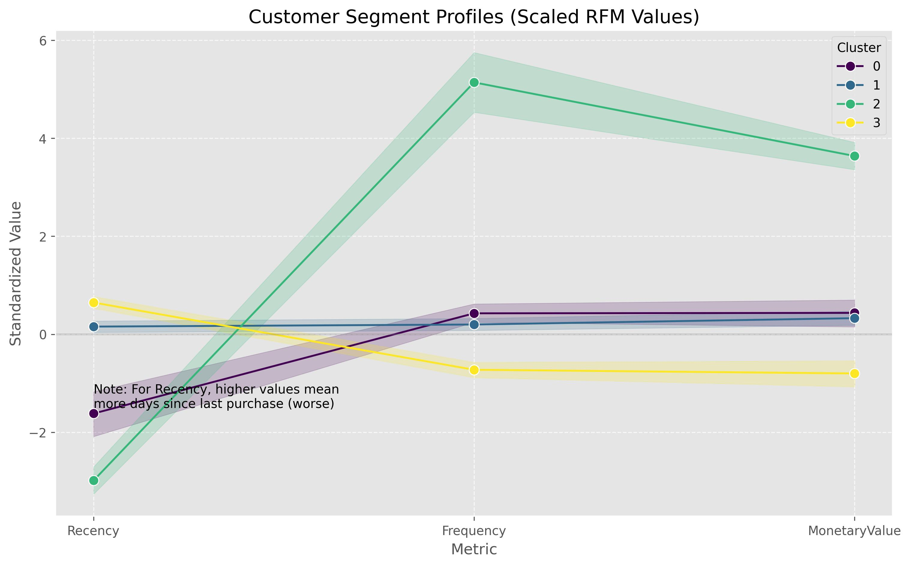
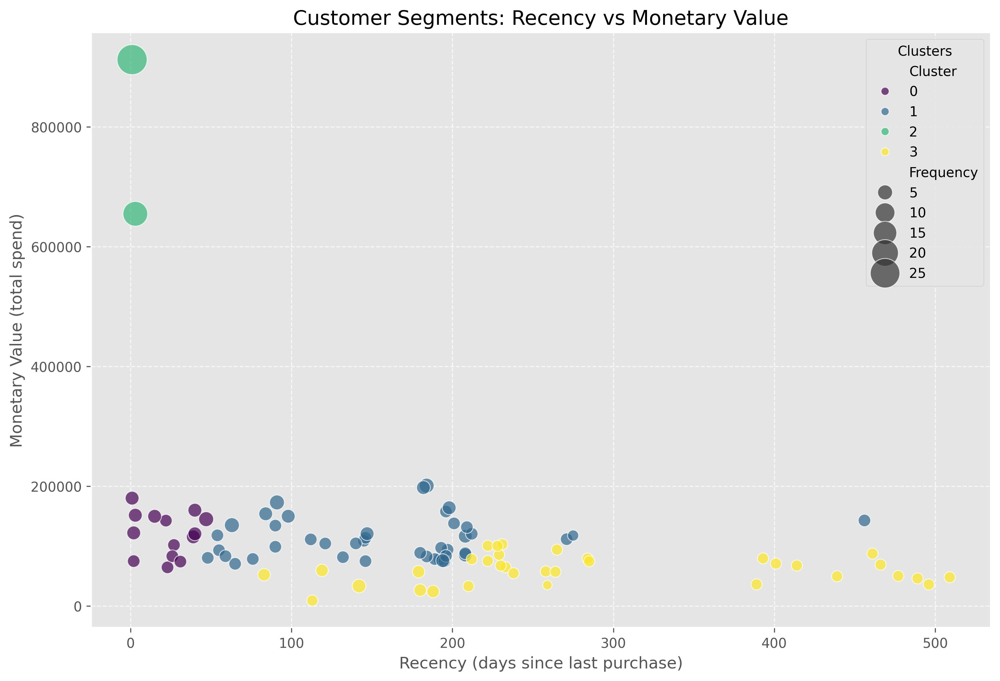
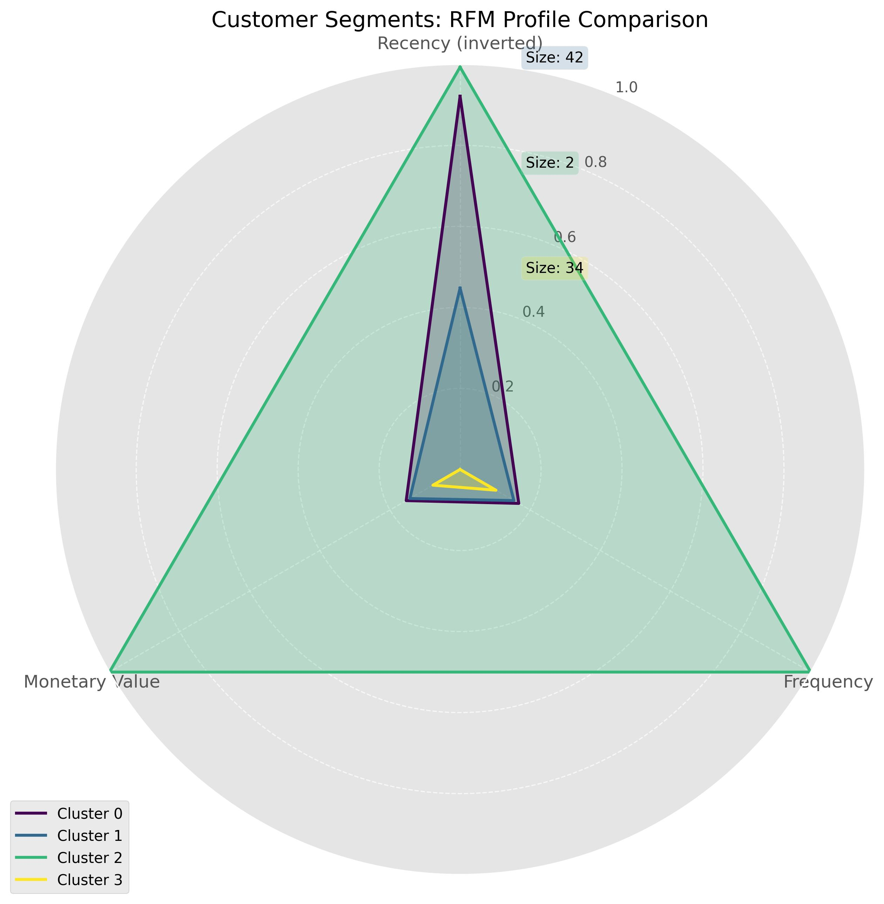
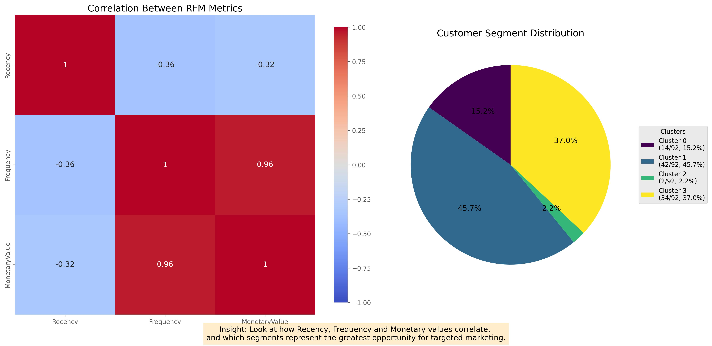

# Customer Segmentation Analysis

A data-driven marketing segmentation tool that uses RFM (Recency, Frequency, Monetary) analysis and K-means clustering to identify distinct customer segments from sales data.

## 📊 Key Features

- **Advanced Customer Profiling**: Segments customers based on purchase behavior patterns using Python, Pandas, and NumPy
- **Machine Learning Integration**: Implements K-means clustering to identify 4 distinct customer personas
- **Business-Ready Insights**: Translates data into actionable marketing strategies for each segment
- **Interactive Visualizations**: Creates comprehensive visual analysis using Matplotlib and Seaborn

## 🔍 Methodology

1. **Data Preprocessing**: Cleans and transforms raw sales data
2. **RFM Calculation**: Measures customer value through:
   - Recency (days since last purchase)
   - Frequency (number of purchases)
   - Monetary value (total spending)
3. **Statistical Transformation**: Applies log transformation and standardization
4. **Cluster Optimization**: Uses Elbow method to determine optimal number of clusters
5. **Segment Analysis**: Profiles customer groups and recommends targeting strategies

## 📈 Visualizations

### RFM Distributions


### Elbow Method


### Customer Segment Profiles


### Recency vs Monetary Value


### RFM Profile Comparison


### Correlation Analysis and Segment Distribution


## 💡 Key Findings

- **Champions (Cluster 2)**: High-value, recent, frequent buyers (2% of customers)
- **At-Risk High Value (Cluster 1)**: Previous good customers who haven't purchased recently (45.7%)
- **Potential Loyalists (Cluster 0)**: Recent moderate buyers with growth potential (15.2%)
- **Need Attention (Cluster 3)**: Low engagement customers at risk of churning (37.0%)

## 📝 Future Improvements

- Implement predictive lifetime value models
- Add demographic data for more nuanced segmentation
- Create A/B testing framework for marketing strategy validation

## 🚀 Getting Started

```python
# Clone repository
git clone https://github.com/your-username/customer_segmentation_analysis.git

# Install requirements
pip install pandas numpy scikit-learn matplotlib seaborn

# Run Jupyter notebook
jupyter notebook customer_segmentation.ipynb
```

## 📊 Dataset

Uses a sample sales dataset with transaction history. The analysis can be adapted to any sales data with customer identifiers, purchase dates and monetary values.
